# **Bidirectional DC/DC Converter with Dual Energy Storage**

## **Two Sources. One Motor. Zero Wasted Braking Energy.**

**A Hardware-Validated Power Management System for Electric Vehicle Powertrains**

[About](#about-the-project) • [The Solution](#the-solution) • [Technology](#technology) • [Design Calculations](#design-calculations) • [Simulation & Results](#simulation--results) • [Hardware Testing](#hardware-testing) • [Team](#team)

---

## **The Problem**

### **Meet a Typical EV Drivetrain**

A commuter EV pulls away from a stoplight. The single lithium-ion battery pack has to deliver a hard current spike to get the car moving — the same battery that, seconds later, is asked to *absorb* a spike of regenerative current when the driver brakes for the next light. Every one of these cycles adds stress the cell chemistry was never designed for.

### **Not Only That EV...**

**Single-battery EV powertrains run into the same wall again and again:**

- Batteries have **high energy density but poor peak-power response** — they're slow to react to sudden acceleration or braking demand
- **Unidirectional converters** can't route energy back from the motor, so regenerative braking energy is either dumped as heat or handled poorly
- Repeated high-current cycling **accelerates battery degradation** and shortens pack lifespan
- Most systems lack **adaptive, real-time control** — power sharing is either fixed or absent entirely

---

## **About the Project**

### **Background**

Electric vehicle traction systems are only as good as their energy management. A single-battery architecture forces one component to do two conflicting jobs: sustain long-duration cruising power *and* absorb sharp transient spikes. This project addresses that conflict directly with a **dual energy storage architecture** — a lithium-ion battery for sustained energy delivery, paired with a supercapacitor bank for high-power transients — connected through a **bidirectional buck-boost DC-DC converter** and driven by a **custom three-phase inverter**.

**This project moves energy management from reactive to intelligent** by combining:

- **Dual Energy Storage**: Li-ion battery (energy density) + supercapacitor bank (power density) working in tandem
- **Bidirectional Power Flow**: A two-switch buck-boost converter that reverses direction for regenerative braking
- **Real-Time Embedded Control**: STM32F411RE microcontroller generating Hall-sensor-synchronized PWM for both the converter and inverter
- **Model-Based Design**: Full MATLAB/Simulink open-loop and closed-loop validation before hardware deployment

### **Our Objective**

Build and validate — in both simulation and hardware — a compact EV energy management system that:

- **Shares power intelligently**: supercapacitor handles the initial acceleration current spike, battery takes over for sustained cruising
- **Recovers braking energy**: reverse power flow from motor → converter → supercapacitor during regenerative braking
- **Regulates speed under load**: closed-loop PI control keeps PMSM speed stable across a 0.5–2 Nm torque range
- **Protects itself**: current-sensor-driven shutdown logic halts PWM output before an overcurrent event can damage switches

---

## **What This Is (and Isn't)**

Hybrid battery + supercapacitor storage, bidirectional buck-boost conversion, and regenerative braking recovery are established topics in EV power electronics research — not a new architecture (see the Literature Survey in the project report, particularly refs [2], [16], [17], [21]). What distinguishes this project is that it doesn't stop at simulation: the converter, inverter, and control loop were built, flashed to an STM32, and validated on real hardware with an oscilloscope, not just modeled in MATLAB/Simulink.

---

## **The Solution**

### **Four-Stage Power Architecture**

This is a complete, hardware-realized power path: **battery + supercapacitor → bidirectional converter → DC link → three-phase inverter → PMSM motor**, with the same path running in reverse during regenerative braking. The system continuously reads battery state, supercapacitor state, motor speed, and rotor position, and uses that to decide — moment to moment — whether the converter should be boosting power to the motor or bucking recovered energy back into the supercapacitor.

<figure>
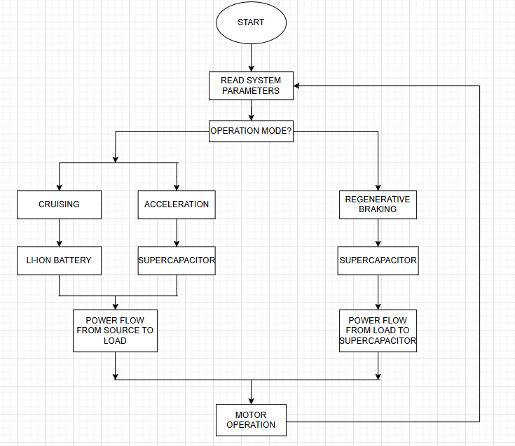
<figcaption><em>System control flow — the controller reads system parameters every cycle and routes power based on operating mode (cruising / acceleration / regenerative braking).</em></figcaption>
</figure>

### **1. Dual Energy Storage**

**Two complementary storage technologies, sized and combined for this specific power profile:**

- **Battery pack**: 7 Li-ion cells in series → 25.9 V, 0.42 Ω pack resistance, 64.75 W sustained output
- **Supercapacitor bank**: 9 cells in series → 24.3 V, 55.5 F, 0.0288 Ω ESR — built for near-instant current delivery
- **Role split**: supercapacitor fronts sudden acceleration/braking transients; battery carries steady cruising load
- **Effect**: battery sees a smoother current profile, which is the primary lever for extending pack lifespan

### **2. Bidirectional DC-DC Converter**

**Two-switch buck-boost topology that reverses its own operating mode based on power flow direction:**

<figure>
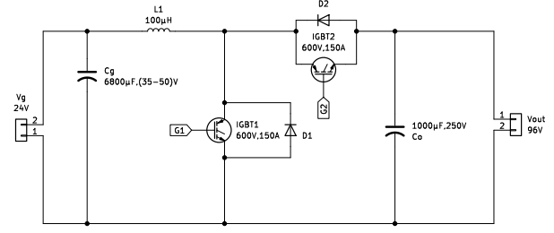
<figcaption><em>Fig. 3.11 — Two-switch bidirectional buck-boost converter. IGBT1/D1 handle boost mode (source → load); IGBT2/D2 handle buck mode (load → source) during regen braking.</em></figcaption>
</figure>

- **Boost mode** (motoring): steps 24 V input up to a 96 V DC link, Dboost = 0.75
- **Buck mode** (regen braking): steps motor-side voltage back down to a safe supercapacitor charging level, Dbuck = 0.25
- **Switching device**: SKM100GB07E3 Semikron IGBT modules (650 V, 128 A) — internally two IGBTs in a half-bridge with anti-parallel diodes

<figure>
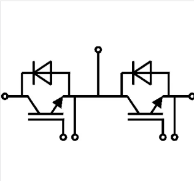
<figcaption><em>Fig. 3.4 — Internal half-bridge structure of a single Semikron IGBT module.</em></figcaption>
</figure>

- **Rated for**: 750 W output, 50 kHz switching frequency, 100 µH inductor, 6800 µF input / 1000 µF output capacitance

### **3. Three-Phase Full-Bridge Inverter + PMSM Drive**

**Custom-built inverter, 120° conduction mode, six-step commutation:**

<figure>
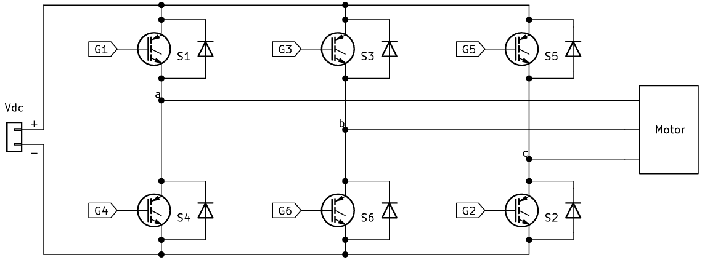
<figcaption><em>Fig. 3.12 — Three-phase full-bridge inverter. Six IGBT switches (S1–S6), one upper and one lower conducting at any instant, driving the PMSM's R-Y-B phases.</em></figcaption>
</figure>

- **Six IGBT switches** (three Semikron half-bridge modules) driving an R-Y-B PMSM motor
- **Hall-effect rotor position feedback** (3 sensors, 120° apart) drives commutation logic and speed estimation
- **Dead-time protection**: 100 ns insertion (100 kΩ gate driver resistor) prevents shoot-through faults
- **Open-loop and closed-loop modes**: fixed duty cycle vs. PI-controller-regulated speed tracking

<figure>
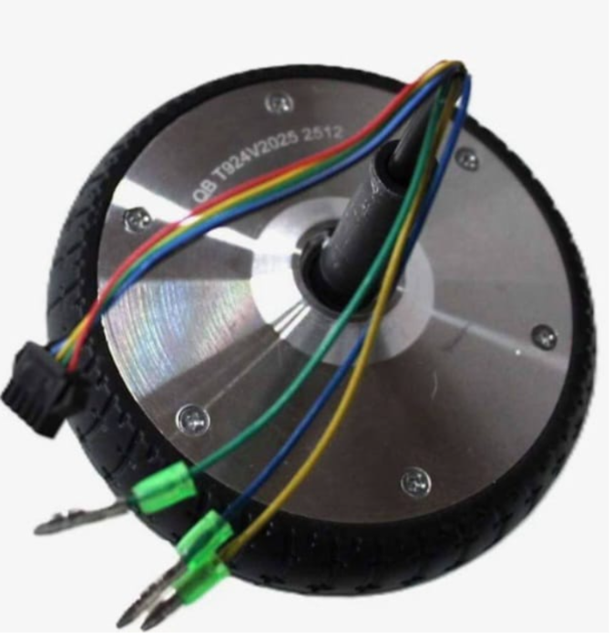
<figcaption><em>Fig. 5.9 — PMSM motor with R/Y/B phase leads and Hall sensor (A/B/C) output terminals.</em></figcaption>
</figure>

---

## **System & Software Requirements**

### Hardware Overview

The system integrates a battery pack, supercapacitor bank, bidirectional DC-DC converter, DC link capacitor, three-phase inverter, and PMSM motor, all coordinated by an STM32F411RE microcontroller reading Hall and current sensor feedback.

#### Hardware Functionality

| Requirement ID | Requirement Title | Description | Rationale |
|----------------|-------------------|--------------|-----------|
| HRS 01 | Bidirectional Power Flow | Converter shall operate in boost mode (source → load) and buck mode (load → source) without hardware reconfiguration. | Enables both motor drive and regenerative braking through the same power stage. |
| HRS 02 | Dual Storage Integration | System shall interface a Li-ion battery pack and a supercapacitor bank as independent, individually monitored sources. | High-power transients and long-duration loads have fundamentally different storage requirements. |
| HRS 03 | Current Protection | Current sensors on the DC link and all three inverter legs shall trigger immediate PWM shutdown on overcurrent. | Protects IGBT switches and motor windings from damage during fault conditions. |
| HRS 04 | Rotor Position Feedback | Three Hall-effect sensors, 120° apart, shall provide real-time commutation and speed data to the MCU. | Six-step commutation and closed-loop speed control both depend on accurate rotor position. |
| HRS 05 | Switching Reliability | Inverter gate drivers shall enforce a minimum 100 ns dead time between complementary switches. | Prevents shoot-through short-circuit faults across the DC bus. |
| HRS 06 | Gate Signal Isolation | Gate driver shall step up 3.3 V MCU logic to a 15 V gate drive signal via an isolated half-bridge driver. | Semikron IGBT modules require ≥15 V gate drive for reliable low-loss switching. |

### Software Overview

The embedded control stack generates PWM for both the converter and inverter, processes Hall sensor feedback for six-step commutation and speed estimation, and runs a PI control loop for closed-loop speed regulation.

#### Software Functionality

| Requirement ID | Requirement Title | Description | Rationale |
|----------------|-------------------|--------------|-----------|
| SRS 01 | Model-Based Code Generation | Control logic shall be developed in Simulink and converted to embedded C via Embedded Coder / Simulink Coder / MATLAB Coder. | Reduces manual firmware bugs and keeps simulation and hardware behavior consistent. |
| SRS 02 | Closed-Loop Speed Regulation | A PI controller shall compare reference speed to measured speed and adjust PWM duty cycle to minimize error. | Required for stable operation under varying torque load. |
| SRS 03 | Mode-Dependent Switching Logic | Firmware shall route PWM to upper or lower inverter legs depending on motoring vs. regenerative braking mode. | Ensures correct power direction without separate hardware paths. |
| SRS 04 | Hall-Based Commutation | Firmware shall decode three Hall sensor states into six discrete rotor position steps for switching sequence selection. | Six-step (120° conduction) commutation requires unambiguous rotor position per step. |

---

## **Technology**

### **System Architecture**

**Power Stage:**
- **Bidirectional Converter**: 2-switch buck-boost, 24 V → 96 V, 750 W, 50 kHz, SKM100GB07E3 IGBTs
- **DC Link**: 1000 µF / 250 V electrolytic capacitor buffering converter and inverter stages
- **Inverter**: 3-phase full bridge, 120° conduction, six-step commutation, SKM100GB07E3 IGBTs
- **Rectifier**: B6U100A three-phase bridge module (1600 V, 100 A) for AC-input bench testing

**Control Stage:**

<figure>
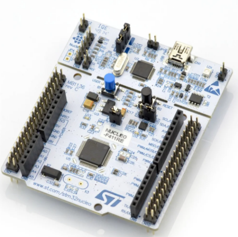
<figcaption><em>Fig. 3.2 — STM32 NUCLEO-F411RE: ARM Cortex-M4F, 100 MHz, 512 KB flash, 128 KB SRAM, 50 GPIO pins.</em></figcaption>
</figure>

- **MCU**: STM32 NUCLEO-F411RE (ARM Cortex-M4F, 100 MHz, 512 KB flash)
- **Sensing**: WCS1800 Hall-effect current sensors (DC link + 3 inverter legs), Hall-effect rotor position sensors
- **Gate Drivers**: Isolated half-bridge drivers, 3.3 V logic → 15 V gate drive, manual dead-time adjustment

<figure>
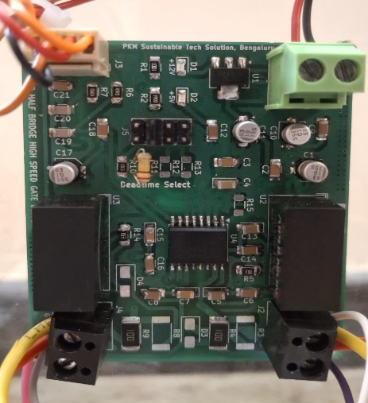
<figcaption><em>Fig. 3.10 — Isolated half-bridge gate driver board with dead-time select header.</em></figcaption>
</figure>

<figure>
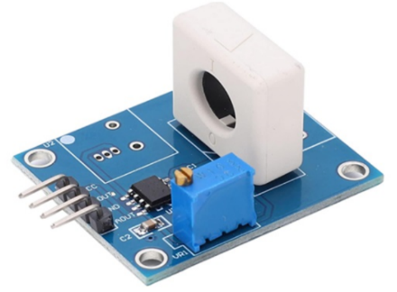
<figcaption><em>Fig. 3.5 — WCS1800 Hall-effect current sensor (±0–35 A DC, RMS 25 A AC, 4000 V isolation).</em></figcaption>
</figure>

- **Design Tools**: MATLAB/Simulink, Motor Control Blockset, Embedded Coder, STM32CubeMX, STM32CubeProgrammer

### **Microcontroller Pin Mapping**

| Function | Pin(s) | Timer |
|:---------|:-------|:------|
| Inverter upper legs (S1, S3, S5) | PA8, PA9, PA10 | TIM1 CH1/CH2/CH3 (complementary) |
| Inverter lower legs (S4, S6, S2) | PB13, PB0, PB1 | TIM1 CH1N/CH2N/CH3N |
| Converter switches | PC6, PC8 | TIM3 |
| Hall sensors A/B/C | PB6, PB5, PB4 | GPIO input |
| Current sensor — inverter legs | PB7, PC13, PC14 | GPIO input |
| Current sensor — DC link | PC15 | GPIO input |

TIM1 supports complementary PWM generation (CH + CHN) with hardware dead-time insertion, which is why it drives the inverter; TIM3 lacks this feature and is used for the simpler two-switch converter instead.

### **Control Logic**

| Mode | Converter State | Power Path | Speed Control |
|:-----|:----------------|:-----------|:---------------|
| **Cruising** | Boost | Battery → DC link → Motor | Battery-dominant, supercapacitor idle/monitored |
| **Acceleration** | Boost | Supercapacitor (initial) → Battery (sustained) → Motor | Supercapacitor fronts the current spike |
| **Regenerative Braking** | Buck | Motor → DC link → Supercapacitor | Reverse power flow, protected charge rate |

---

## **Design Calculations**

### **Battery Pack**

| Parameter | Formula | Value |
|:----------|:--------|:------|
| Cells in series | N = 24 / 3.7 | 7 (rounded up) |
| Pack voltage | Vpack = N × Vcell = 7 × 3.7 | 25.9 V |
| Pack resistance | Rpack = N × Rcell = 7 × 0.06 | 0.42 Ω |
| Max sustained power | Pout = Vpack × Imax = 25.9 × 2.5 | 64.75 W |

### **Supercapacitor Bank**

| Parameter | Formula | Value |
|:----------|:--------|:------|
| Cells in series | N = 24 / 2.7 | 9 (rounded up) |
| Bank voltage | Vbank = N × Vcell = 9 × 2.7 | 24.3 V |
| Total capacitance | C = Ccell / N = 500 / 9 | 55.5 F |
| Bank ESR | ESR = N × ESRcell = 9 × 0.0032 | 0.0288 Ω |

### **Bidirectional Converter**

| Parameter | Formula | Value |
|:----------|:--------|:------|
| Boost duty cycle | Dboost = 1 − (Vin / Vo) | 0.75 |
| Buck duty cycle | Dbuck = Vin / Vo | 0.25 |
| Output current | Io = Po / Vo | 7.8125 A |
| Input current | Iin = Pin / Vin | 34.722 A |
| Inductance | L = (Vin × D) / (ΔIL × fs) | 100 µH |
| Input capacitance | Cg = (Iin × D) / (fs × ΔVin) | 6800 µF |
| Output capacitance | Co = (Io × D) / (fs × ΔVo) | 1000 µF |

**Final converter parameters:**

| Parameter | Value |
|:----------|:------|
| Input Voltage | 24 V |
| Output Voltage | 96 V |
| Output Power | 750 W |
| Switching Frequency | 50 kHz |
| Efficiency (design target) | 90% |

---

## **Simulation & Results**

Both open-loop and closed-loop configurations were built and validated in MATLAB/Simulink — using the Motor Control Blockset for Hall decoding, speed estimation, and six-step commutation — before any hardware was powered on.

### **Open-Loop Model**

<figure>
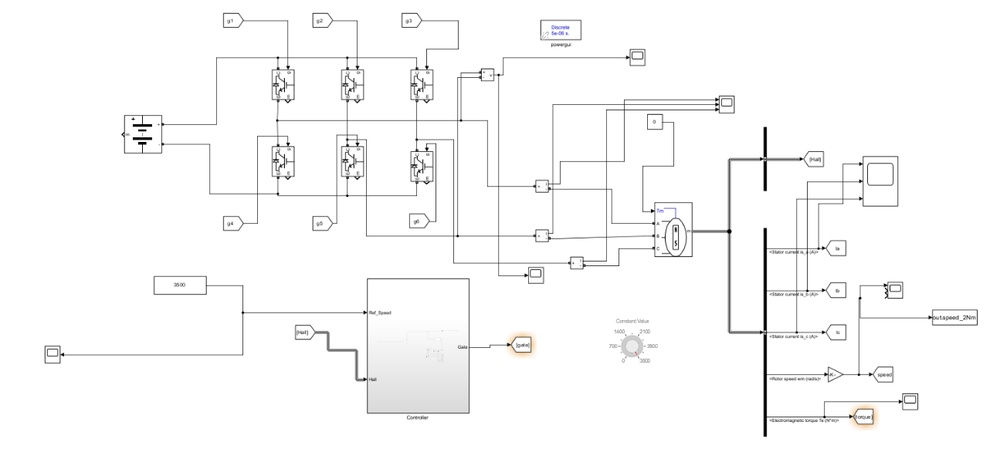
<figcaption><em>Fig. 4.1 — Open-loop Simulink model. Fixed PWM duty cycle, predefined commutation, no speed feedback.</em></figcaption>
</figure>

With no PI controller and no reference-speed comparison, the open-loop system cannot correct for load changes — speed simply follows applied voltage and torque.

<figure>
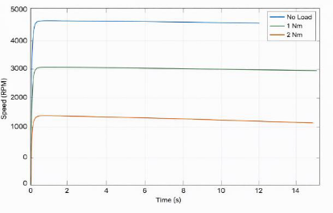
<figcaption><em>Fig. 5.2 — Open-loop speed response at no load, 1 Nm, and 2 Nm. Speed settles at a different point for each load with no corrective action — this instability is exactly what closed-loop control fixes.</em></figcaption>
</figure>

### **Closed-Loop Model**

<figure>
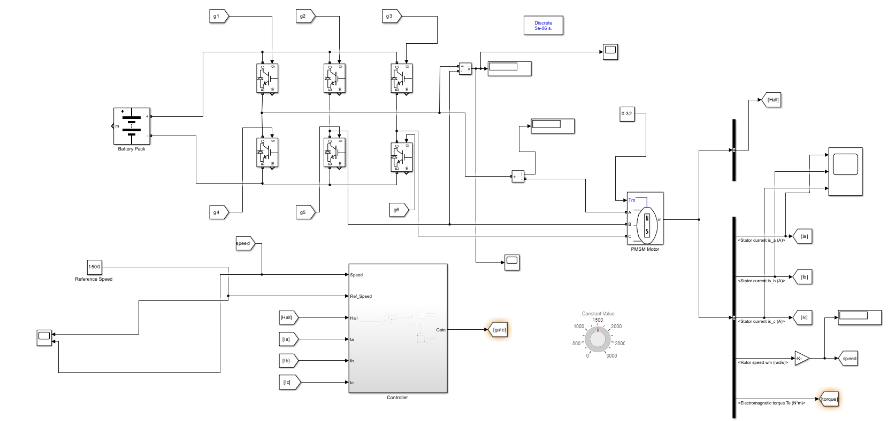
<figcaption><em>Fig. 4.4 — Closed-loop model. The controller now compares reference speed against measured speed (via Hall feedback) and adjusts PWM duty cycle through a PI loop.</em></figcaption>
</figure>

**Hall decoding subsystem** — converts three raw Hall signals into the six commutation states used by the six-step block:

<figure>
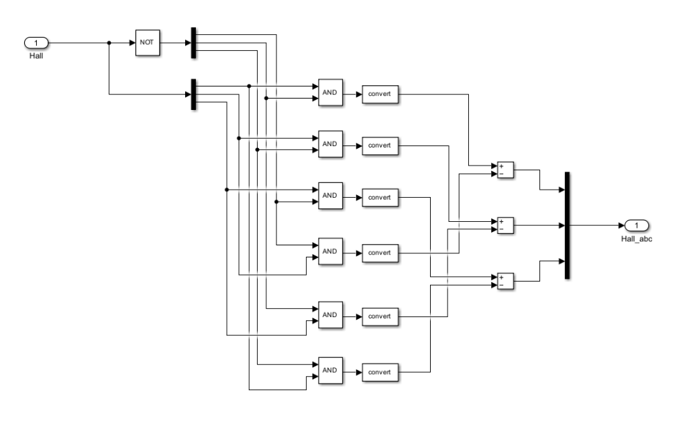
<figcaption><em>Fig. 4.2 — Decoder subsystem: Hall A/B/C → six-step commutation state.</em></figcaption>
</figure>

### **Closed-Loop Results**

| Test Condition | Result |
|:----------------|:-------|
| Constant 1000 RPM reference, 0.5 Nm applied | Speed holds flat at 1000 RPM — PI controller fully compensates |
| Torque stepped 0.5 → 1 → 1.5 → 2 Nm | Speed remains constant at 1000 RPM at every step; current draw increases with torque |
| Speed reference stepped 2500 → 0 RPM | Motor tracks the step changes with only slight torque disturbance |
| Reference speed 1000 → 750 RPM | Motor speed follows and re-stabilizes at the new setpoint within seconds |

<p float="left">
  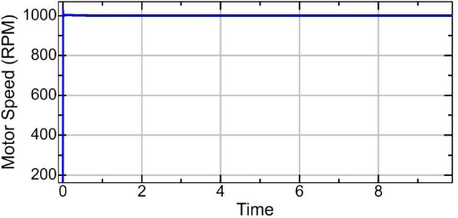
  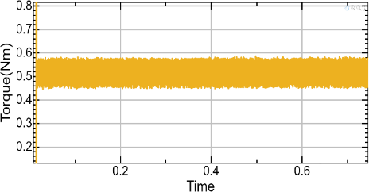
</p>
<em>Fig. 5.5(a)/(b) — Speed and torque vs. time at 1000 RPM under 0.5 Nm applied load. Speed does not deviate despite the applied torque, due to PI corrective action.</em>

<p float="left">
  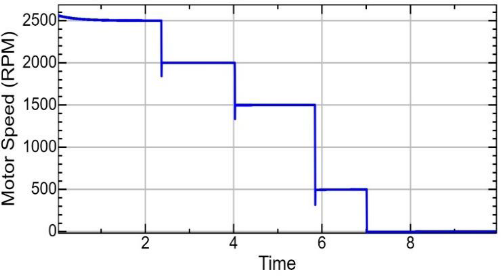
  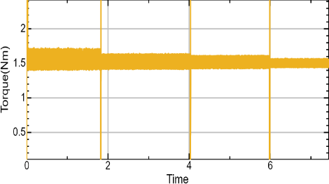
</p>
<em>Fig. 5.7(a)/(b) — Motor speed stepped from 2500 RPM down to zero, while applied torque remains nearly constant, demonstrating stable dynamic response.</em>

### **Key Findings**

- Closed-loop speed tracking follows step changes in reference speed and re-stabilizes within seconds
- Stator current magnitude scales directly with applied torque (~±10 A at 1.35 Nm) — confirms expected PMSM current-torque relationship
- Speed remains constant up to the motor's rated torque (2.04 Nm); beyond that, closed-loop control can no longer fully compensate and speed begins to drop
- Some noise appears in the actual-speed signal during transitions, attributable to PI gain tuning — noted as a refinement opportunity, not a control failure

---

## **Hardware Testing**

### **Converter Validation**

The buck-boost converter was tested standalone using a single Semikron switch, mounted with the rectifier and diodes on a heat sink, with a rheostat load on the output.

| Mode | Input | Duty Cycle | Measured Output | Theoretical Relation |
|:-----|:------|:-----------|:------------------|:----------------------|
| Buck | 24 V | 25% | ~6 V | Vout = Vin × D |
| Boost | 24 V | 75% | Higher than Vin | Vout = Vin / (1 − D) |

Both modes matched theoretical predictions across a range of duty cycles, confirming the buck-boost topology performs as designed before it was integrated into the full system.

### **Inverter + Motor Validation**

Hall sensor readings were first verified independently by manually rotating the motor shaft and logging Hall A/B/C transitions through Simulink's data logging feature — confirming the MCU was correctly reading rotor position before any power switching was attempted.

<figure>
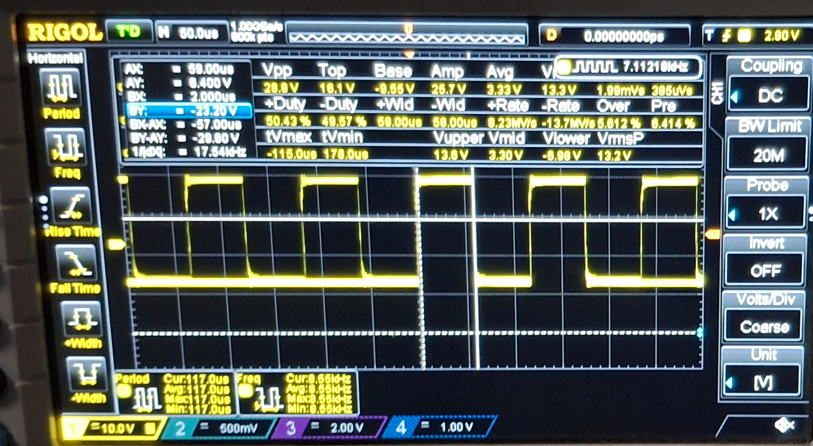
<figcaption><em>Fig. 5.15 — Oscilloscope capture of the high-side gate pulse for inverter leg 1, confirming correct PWM generation from the STM32.</em></figcaption>
</figure>

<figure>
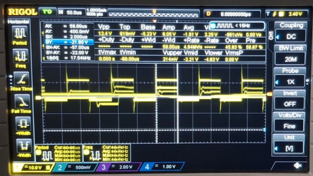
<figcaption><em>Fig. 5.16 — Inverter AC output waveform at 12 V DC input, ~10 V AC output across the R-Y-B phases.</em></figcaption>
</figure>

- At 24 V DC input, inverter produced ~20 V AC output across R-Y-B phases — motor rotated smoothly under open-loop control
- No-load current draw: ~0.2–0.3 A at 24 V input, increasing progressively with supply voltage as expected
- Dead-time insertion (100 ns via 100 kΩ gate driver resistor) confirmed no shoot-through faults during switching

### **Full System Assembly**

All power, sensing, and control terminals were routed to externally accessible banana-plug connectors inside a 5 mm acrylic enclosure — a plug-and-play bench setup for repeatable testing without opening the housing.

<p float="left">
  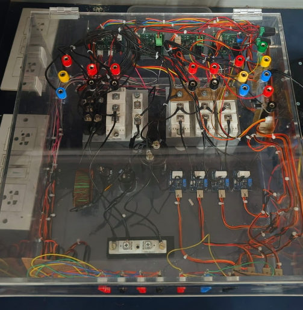
  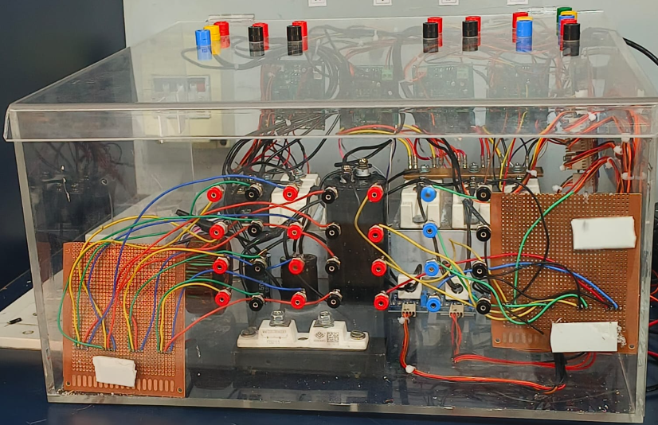
  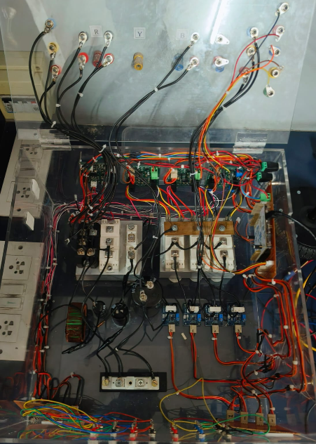
</p>
<em>Fig. 5.12–5.14 — Assembled hardware: converter and inverter IGBT modules, gate driver boards, DC link capacitor, and externally routed terminal connections inside the acrylic enclosure.</em>

<figure>
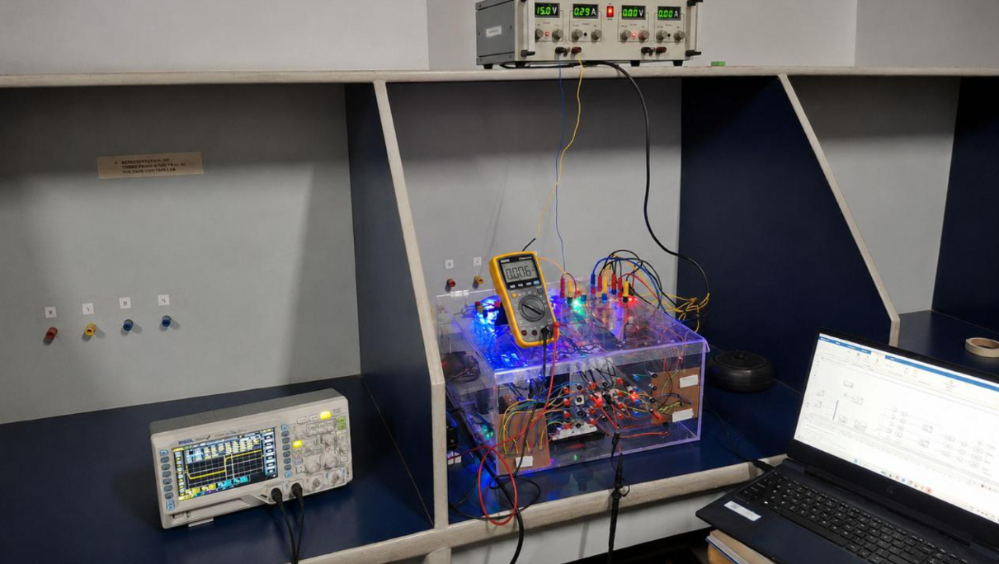
<figcaption><em>Fig. 5.17 — Full bench test setup: oscilloscope, regulated DC supply, multimeter, and the assembled converter/inverter/motor rig running live during testing.</em></figcaption>
</figure>

---

## **Why This Design Stands Out**

| Capability | Single-Battery EV | Unidirectional Converter Systems | **This Project** |
|:-----------|:-------------------|:-----------------------------------|:-------------------|
| **Regenerative Braking Support** | ❌ Limited | ❌ No | ✅ **Yes** |
| **Dual Energy Storage** | ❌ No | ❌ No | ✅ **Yes** |
| **Real-Time Adaptive Power Sharing** | ❌ No | ❌ No | ✅ **Yes** |
| **Closed-Loop Speed Regulation** | ⚠️ Varies | ⚠️ Varies | ✅ **Yes (PI, hardware-tested)** |
| **Hardware-Validated (not just simulated)** | ⚠️ Varies | ⚠️ Varies | ✅ **Yes** |
| **Overcurrent Protection** | ⚠️ Varies | ⚠️ Varies | ✅ **Yes (4-point current sensing)** |

---

## **Project Status & Milestones**

🚀 **Current Phase**: Hardware-validated prototype (converter + inverter + motor tested independently and assembled)
📅 **Last Updated**: AY 2025-26
✅ **Recent Achievement**: Published conference paper on the bidirectional DC/DC converter design; full open-loop hardware validation of converter, inverter, and motor drive complete

**Next steps**: closed-loop hardware deployment (Simulink model → Embedded Coder → STM32), full regenerative braking hardware test, integration of the four-point current-sensing protection logic into the live switching loop.

---

## **Team**

<div style="display: inline-block; justify-content: center; gap: 20px; margin-right: 100px;">
    <div>
        <p><strong>Sourabh Desai</strong></p>
        <a href="mailto:sourabh.desai@dsce.edu">
            
        </a>
        <a href="https://www.linkedin.com/in/sourabh-desai">
            
        </a>
    </div>
</div>

**Core Skills Demonstrated:**
- **Power Electronics**: Bidirectional buck-boost converter design, IGBT gate driving, dead-time protection
- **Embedded Systems**: STM32 PWM generation, Hall-sensor-based commutation, real-time current protection
- **Model-Based Design**: MATLAB/Simulink open-loop and closed-loop control, Embedded Coder deployment
- **Hardware Validation**: Oscilloscope-based switching verification, bench testing, full system assembly

---

## **Acknowledgments**

We would like to express our sincere gratitude to the **Dept. of EEE, DSCE** for guidance and lab support throughout this project, and to everyone who contributed feedback during hardware testing and validation.

---

```
Interested in collaboration, consulting, or deployment?

📧 Email: sourabh.desai@dsce.edu
🔗 LinkedIn: Sourabh Desai
💻 GitHub: @Sourabh-Desai


Citation

If you build upon this work, please cite as:

@misc{desai2025bidirectional,
  author = {Desai, Sourabh},
  title = {Bidirectional DC-DC Converter with Dual Energy Storage for Electric Vehicles},
  year = {2025},
  howpublished = {GitHub},
  url = {https://github.com/Sourabh-Desai/Bidirectional-DC-DC-Converter-}
}

Transforming Energy Distribution for Next-Generation Electric Vehicles

Every Watt Optimized. Every Acceleration Empowered.

Dayananda Sagar College of Engineering (DSCE) | Bengaluru
```
